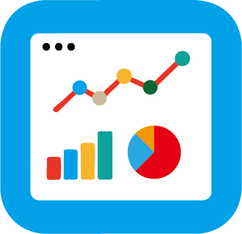
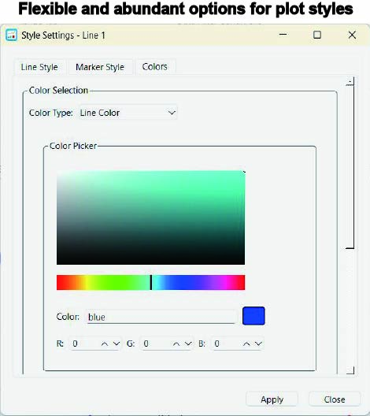

# EZsciplot_GUI
## (The project is actively under development, but the core functionalities have already been completed.)
EZsciplot_GUI is a versatile and user-friendly scientific plotting interface built with PySide6, designed to streamline the visualization and export of research data, particularly in disciplines that require customized plotting workflows.

🌟 **Key Features**

### Custom Plotting Made Shareable
Many scientific fields adopt specific plotting formats or data filtering criteria tailored to their research needs. This tool allows such customized plotting styles to be easily reused and shared within research groups or across the field — even by team members without programming experience.

### Hierarchical Data Structure Support
The interface organizes data from specimen to site (or sample), aligning with the typical data hierarchy used in scientific studies, especially in the Earth and environmental sciences.

### Flexible Styling and Export
Easily adjust color schemes, layout elements, and export high-quality figures for publication or presentations with minimal effort.

### One-Step Initialization for Customization
Simply run the `entrance.py` file to preview the initial functionality. To customize the plotting software, you only need to replace the plotting calculations and decision functions within the `entrance.py` file, making it easy to share your customized software with others.

### Layered Scientific Data Management
Organizes data into a hierarchical structure, divided into site/sample levels, followed by specimen, and then parameter layers. This structure facilitates intuitive data management and navigation.

### Seamless Customization via Dropdown Menu
The software allows for perfect customization of scientific plots through a style dropdown menu, enabling users to adjust the visual style to match their research needs.

### Dual-Tab Interface for Data and Plot Filtering
The dual-tab interface supports filtering data and selecting charts at different hierarchical levels. This feature makes it easy to navigate through complex datasets and focus on specific analysis layers.

---
